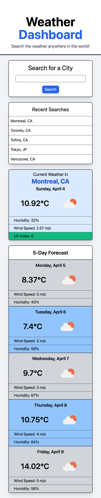

# Weather Dashboard

The purpose of this project was to make a simple application that allows the user to search for the current and forecast weather at a specific city using an input field.

The live application is deployed here: https://stevtm.github.io/weather-dashboard/

## Application Functionality

The application is able to perform the following features:

- Present the current and future conditions for the desired city.
- Present the following information for the city:
  - City Name
  - Date
  - Icon Representation of Weather Conditions
  - Humidity
  - Wind Speed
  - UV Index (colour-coded)
- Saved searched cities in local storage and allow the user to repeat the search by clicking on the city name.

## Screenshot

This is a screenshot of the deployed application!

## References

- Tailwind CSS: https://tailwindcss.com/
- OpenWeather API: https://openweathermap.org/
